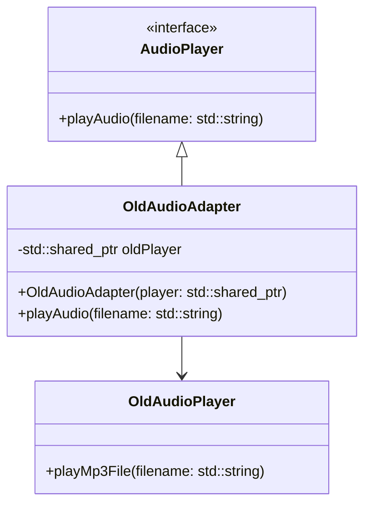

## How to run

```shell
g++ -std=c++17 main.cpp OldAudioAdapter.cpp -o adapter_example
```

```shell
./adapter_example
```

## Class Diagram


```mermaid
classDiagram
    class AudioPlayer {
        <<interface>>
        +playAudio(filename: std::string)
    }

    class OldAudioPlayer {
        +playMp3File(filename: std::string)
    }

    class OldAudioAdapter {
        -std::shared_ptr<OldAudioPlayer> oldPlayer
        +OldAudioAdapter(player: std::shared_ptr<OldAudioPlayer>)
        +playAudio(filename: std::string)
    }

    AudioPlayer <|-- OldAudioAdapter
    OldAudioAdapter --> OldAudioPlayer
```